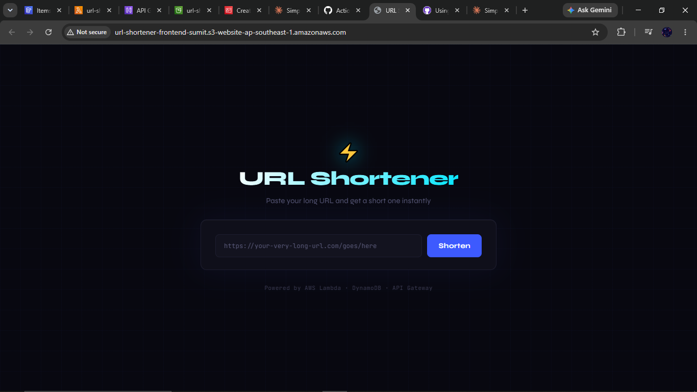
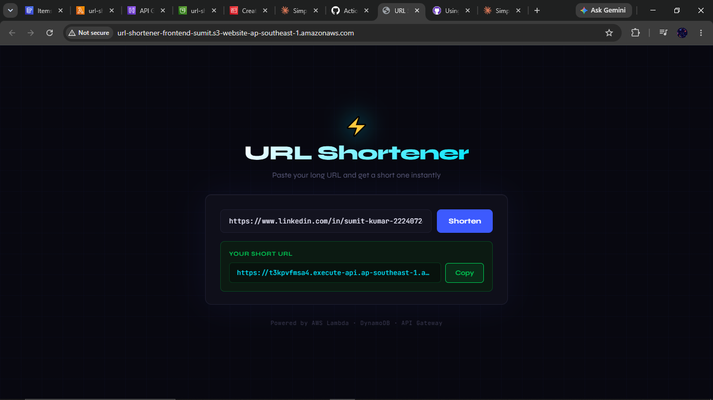
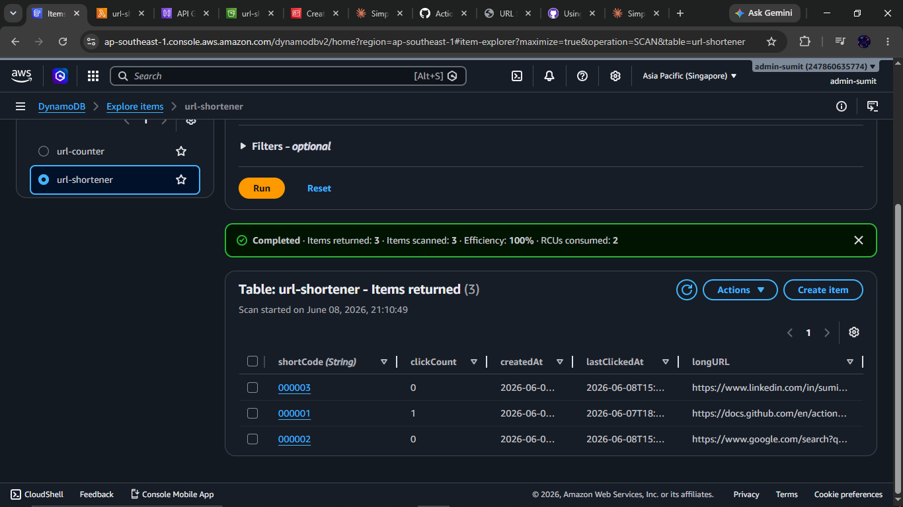
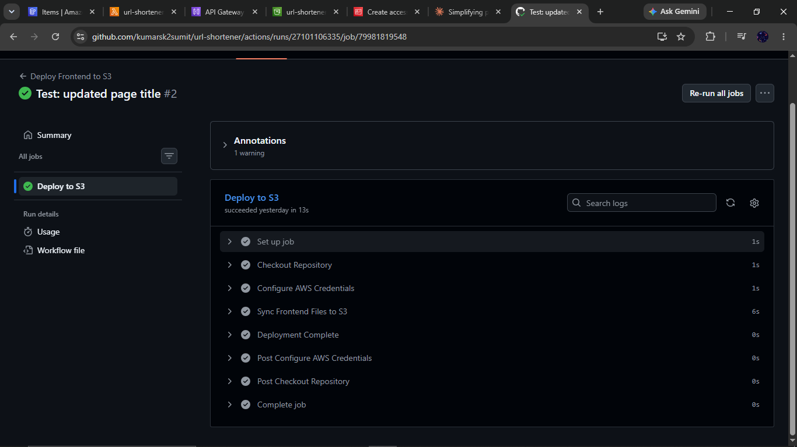
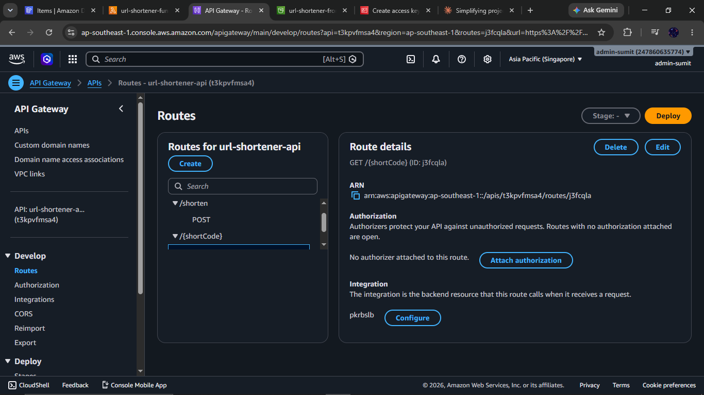
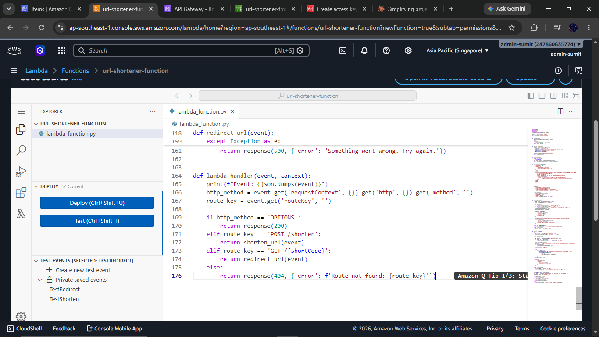

<div align="center">

<br/>


# ⚡ URL Shortener

**A fully serverless URL shortener — no EC2, no servers, zero monthly cost.**

Paste a long URL → get a 6-character short code → click it → **301 redirect** in milliseconds.
Built end-to-end on AWS serverless services with CI/CD automation via GitHub Actions.

<br/>


<br/>

> **Live demo is intentionally offline** to avoid cloud charges.
> All screenshots, architecture, and working code are documented below.
> Can be re-deployed from this repo in under 10 minutes.

</div>

---

## 📸 Project Screenshots

<table>
  <tr>
    <td align="center"><b>Website UI</b><br/></td>
    <td align="center"><b>URL Shortened Successfully</b><br/></td>
  </tr>
  <tr>
    <td align="center"><b>DynamoDB — URL Mappings</b><br/></td>
    <td align="center"><b>GitHub Actions CI/CD</b><br/></td>
  </tr>
  <tr>
    <td align="center"><b>API Gateway Routes</b><br/></td>
    <td align="center"><b>Lambda Function</b><br/></td>
  </tr>
</table>

---

## 🏗️ Architecture

```
┌──────────────────────────────────────────────────────────────────────┐
│                           USER'S BROWSER                             │
└──────────────────────┬───────────────────────────────────────────────┘
                       │ 1. Opens S3 website URL
          ┌────────────▼──────────────┐
          │    S3 STATIC WEBSITE      │  HTML + CSS + JS
          │  index.html hosted on S3  │  No server needed
          │  public website endpoint  │  Auto-scales to any traffic
          └────────────┬──────────────┘
                       │ 2. JavaScript fetch() → POST /shorten
          ┌────────────▼──────────────┐
          │       API GATEWAY         │  HTTP API (not REST)
          │  POST /shorten            │  Routes HTTP requests
          │  GET  /{shortCode}        │  70% cheaper than REST API
          └────────────┬──────────────┘
                       │ 3. Triggers Lambda function
          ┌────────────▼──────────────┐
          │     LAMBDA FUNCTION       │  Python 3.11
          │  • Validate input URL     │  Serverless compute
          │  • Generate short code    │  No EC2 needed, scales to 0
          │  • Collision check (×5)   │
          │  • HTTP 301 redirect      │
          └────────────┬──────────────┘
                       │ 4. Read / Write
          ┌────────────▼──────────────┐
          │         DYNAMODB          │  NoSQL — key-value store
          │  shortCode │ longURL      │  O(1) lookup by partition key
          │  "aB3kX9"  │ "https://…" │  On-demand capacity mode
          │  clickCount│ createdAt   │  Free tier: 25 GB forever
          └───────────────────────────┘

          ┌───────────────────────────┐
          │      GITHUB ACTIONS       │  CI/CD Pipeline
          │  git push → detect change │  Runs on GitHub-hosted Ubuntu VM
          │  → aws s3 sync ./frontend │  Deploys in < 30 seconds
          │  → frontend live on S3    │  Credentials in GitHub Secrets
          └───────────────────────────┘
```

---

## ⚙️ How It Works

### Shorten a URL — `POST /shorten`

```
Input:  https://docs.aws.amazon.com/lambda/latest/dg/getting-started.html

Step 1  Lambda reads longURL from JSON request body
Step 2  Validates URL starts with http:// or https://
Step 3  Generates 6-char random alphanumeric code → "aB3kX9"
        (62^6 = 56 billion possible combinations)
Step 4  Collision check: queries DynamoDB — does "aB3kX9" already exist?
        If yes, retry up to 5 times (in practice: first attempt always works)
Step 5  Saves to DynamoDB:
        { shortCode: "aB3kX9", longURL: "...", createdAt: "...", clickCount: 0 }
Step 6  Returns JSON → { shortURL: "https://api-url/prod/aB3kX9" }
Step 7  JavaScript renders the short URL on screen

Output: https://api-url/prod/aB3kX9
```

### Redirect — `GET /{shortCode}`

```
User clicks: https://api-url/prod/aB3kX9

Step 1  API Gateway extracts shortCode = "aB3kX9" from URL path parameter
Step 2  Lambda queries DynamoDB: GET item where shortCode = "aB3kX9"
Step 3  DynamoDB returns → { longURL: "https://docs.aws.amazon.com/..." }
Step 4  Lambda increments clickCount (UPDATE SET clickCount = clickCount + 1)
Step 5  Returns HTTP 301 with header: Location: "https://docs.aws.amazon.com/..."
Step 6  Browser reads Location header → automatically navigates there
        No JavaScript needed — pure HTTP redirect
```

### Short Code Generation

```python
import random, string

def generate_short_code(length=6):
    chars = string.ascii_letters + string.digits  # 62 chars
    return ''.join(random.choices(chars, k=length))

# Collision check: try up to 5 times before giving up
for attempt in range(5):
    code = generate_short_code()
    existing = table.get_item(Key={'shortCode': code})
    if 'Item' not in existing:
        break  # unique code found, safe to use
```

---

## 📡 API Reference

| Method | Endpoint | Request | Response |
|--------|----------|---------|----------|
| `POST` | `/shorten` | `{ "url": "https://..." }` | `{ "shortURL": "...", "shortCode": "..." }` |
| `GET` | `/{shortCode}` | — | `HTTP 301` redirect to original URL |

### Shorten a URL
```bash
curl -X POST https://API_URL/prod/shorten \
  -H "Content-Type: application/json" \
  -d '{"url": "https://www.github.com"}'
```
```json
{
  "shortURL": "https://API_URL/prod/xK9mB2",
  "shortCode": "xK9mB2",
  "longURL": "https://www.github.com",
  "message": "URL shortened successfully!"
}
```

### Test a Redirect
```bash
curl -v https://API_URL/prod/xK9mB2
# Returns: HTTP/1.1 301 Moved Permanently
# Location: https://www.github.com
```

---

## 🛠️ Tech Stack

| Service | Role | Why This Choice |
|---------|------|-----------------|
| **AWS Lambda (Python 3.11)** | Business logic — shorten & redirect | No server cost, auto-scales to 0 when idle |
| **Amazon DynamoDB** | Store URL mappings | O(1) key-value lookup, scales to millions of req/s |
| **API Gateway (HTTP API)** | Public HTTP endpoints | Exposes Lambda to internet; 70% cheaper than REST API |
| **Amazon S3** | Frontend static hosting | No web server needed, nearly free, auto-scales |
| **GitHub Actions** | CI/CD pipeline | Auto-deploys frontend to S3 on every `git push` |
| **IAM Roles** | Service permissions | Least-privilege between Lambda ↔ DynamoDB ↔ S3 |
| **CloudWatch** | Lambda logging | Debug errors, monitor cold starts, track invocations |

---

## 🔐 Security & IAM Design

Two separate IAM identities, each with only the minimum permissions needed:

```
Lambda Execution Role (lambda-url-shortener-role)
├── AWSLambdaBasicExecutionRole   → write logs to CloudWatch
└── AmazonDynamoDBFullAccess      → read/write the url-shortener table

GitHub Actions IAM User (github-actions-s3-deployer)
└── AmazonS3FullAccess            → sync frontend files to S3 bucket

GitHub Secrets (encrypted, never in code)
├── AWS_ACCESS_KEY_ID
├── AWS_SECRET_ACCESS_KEY
└── S3_BUCKET_NAME
```

---

## 🔄 CI/CD Pipeline

Every `git push` to `main` triggers this workflow automatically:

```yaml
# .github/workflows/deploy.yml
name: Deploy Frontend to S3

on:
  push:
    branches: [main]

jobs:
  deploy:
    runs-on: ubuntu-latest
    steps:
      - name: Checkout code
        uses: actions/checkout@v3

      - name: Configure AWS credentials
        uses: aws-actions/configure-aws-credentials@v2
        with:
          aws-access-key-id: ${{ secrets.AWS_ACCESS_KEY_ID }}
          aws-secret-access-key: ${{ secrets.AWS_SECRET_ACCESS_KEY }}
          aws-region: ap-southeast-1

      - name: Deploy frontend to S3
        run: |
          aws s3 sync ./frontend s3://${{ secrets.S3_BUCKET_NAME }} --delete
```

**What happens:**
1. GitHub detects push to `main`
2. Spins up a fresh Ubuntu VM (GitHub-hosted runner)
3. Checks out the repository
4. Configures AWS credentials from GitHub Secrets (never exposed in logs)
5. Syncs `./frontend` folder to S3 bucket, deletes removed files
6. Frontend is live in under 30 seconds

---

## 🗂️ Project Structure

```
url-shortener/
│
├── .github/
│   └── workflows/
│       └── deploy.yml          ← GitHub Actions CI/CD pipeline
│
├── frontend/
│   ├── index.html              ← Single-page app structure
│   ├── style.css               ← Dark-themed UI
│   └── script.js               ← fetch() API calls, DOM manipulation
│
├── lambda/
│   └── lambda_function.py      ← Complete Lambda handler (Python 3.11)
│
├── screenshots/
│   ├── website.png             ← Live website screenshot
│   ├── demo.png                ← URL shortened result
│   ├── dynamodb.png            ← DynamoDB items view
│   ├── api-gateway.png         ← API Gateway routes
│   ├── lambda.png              ← Lambda function code
│   └── cicd.png                ← GitHub Actions successful run
│
└── README.md
```

---

## 💰 Cost Analysis

| Service | Free Tier Limit | This Project's Usage | Monthly Cost |
|---------|----------------|----------------------|-------------|
| Lambda | 1M requests/month | < 1,000 requests | **₹0** |
| DynamoDB | 25 GB + 25 RCU/WCU | < 1 MB storage | **₹0** |
| API Gateway | 1M calls/month | < 1,000 calls | **₹0** |
| S3 | 5 GB + 20K GET requests | < 100 KB frontend files | **₹0** |
| GitHub Actions | 2,000 min/month | < 10 minutes | **₹0** |
| CloudWatch | 5 GB logs/month | < 1 MB logs | **₹0** |

**Total monthly cost: ₹0** — fully within AWS Free Tier.

> Services are currently offline to avoid unexpected charges from public traffic.
> The entire stack can be re-deployed in under 10 minutes from this codebase.

---

## 🧠 Concepts Learned

**AWS Serverless**
- API Gateway HTTP API — route config, Lambda integration, CORS, stage deployment
- Lambda — handler structure, event parsing, response format, cold starts, IAM roles
- DynamoDB — partition key design, `put_item`, `get_item`, `update_item` with `UpdateExpression`

**HTTP & Networking**
- How HTTP 301 redirects work — the `Location` header, browser behavior
- CORS — why browsers block cross-origin requests, OPTIONS preflight, configuring headers
- REST API design — clean route naming, correct HTTP status codes (200, 301, 400, 404, 500)

**DevOps & CI/CD**
- GitHub Actions — YAML workflow syntax, job steps, GitHub Secrets
- `aws s3 sync` — incremental deployments, `--delete` flag
- IAM least-privilege — separate roles for separate services

**Architecture Thinking**
- Why NoSQL (DynamoDB) beats SQL for this use case — simple key-value lookups
- Why HTTP API beats REST API — cost, simplicity, latency
- Why S3 static hosting beats EC2 — cost, zero maintenance, auto-scaling

---

## 🚀 Re-Deploy From Scratch

> Prerequisites: AWS Account + GitHub Account + AWS CLI configured

```bash
# 1. Clone this repo
git clone https://github.com/kumarsk2sumit/url-shortener
cd url-shortener

# 2. DynamoDB — create table
#    Table name: url-shortener
#    Partition key: shortCode (String)
#    Billing: On-demand

# 3. Lambda — create function
#    Runtime: Python 3.11  |  Region: ap-southeast-1
#    Paste code from lambda/lambda_function.py
#    Attach IAM role with DynamoDB access

# 4. API Gateway — create HTTP API
#    POST /shorten → Lambda integration
#    GET /{shortCode} → Lambda integration
#    Enable CORS  |  Deploy to 'prod' stage
#    Copy Invoke URL → paste into frontend/script.js

# 5. S3 — create bucket
#    Enable static website hosting  |  index.html as root
#    Disable block public access  |  Add public bucket policy

# 6. GitHub Secrets — add three secrets:
#    AWS_ACCESS_KEY_ID, AWS_SECRET_ACCESS_KEY, S3_BUCKET_NAME

# 7. Push to main → GitHub Actions deploys frontend automatically
git push origin main
```

---

<div align="center">

**Built by Sumit Kumar**

[GitHub](https://github.com/kumarsk2sumit) · [Email](mailto:kumarsk2sumit@gmail.com)

<sub>Built with ☁️ AWS Serverless · Python 3.11 · GitHub Actions CI/CD</sub>

</div>
